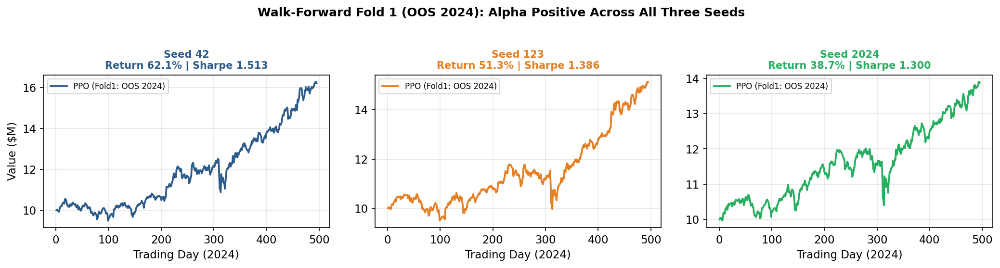
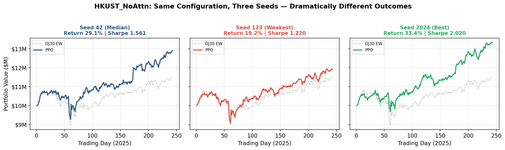

# Portfolio Optimization with FinBERT and PPO

An undergraduate research project investigating whether domain-specific
financial sentiment can improve reinforcement-learning portfolio allocation
without sacrificing experimental rigor.

The framework combines FinBERT sentiment features, a custom multi-asset trading
environment, Proximal Policy Optimization (PPO), optional cross-asset attention,
classical portfolio baselines, multi-seed evaluation, bootstrap inference, and
walk-forward validation.

> Research and educational use only. This repository does not provide
> investment advice.

## Research question

Can sentiment-enhanced reinforcement learning improve out-of-sample portfolio
allocation when results are evaluated across random seeds, ablations, and
walk-forward folds?

## Method

- Universe: 30 large-cap US equities represented by the project Dow 30 list.
- Period: 2022-2025, with chronological train, validation, and test splits.
- Sentiment: domain-specific FinBERT scores derived from 310,648 financial news
  articles.
- Agent: Stable-Baselines3 PPO with a custom Gymnasium portfolio environment.
- Ablations: six primary configurations across three fixed seeds (18 runs),
  plus confidence-gated sentiment experiments.
- Baselines: equal weight, mean variance, minimum variance, and risk parity.
- Evaluation: transaction costs, validation checkpoint selection, train-only
  preprocessing statistics, multi-seed aggregation, bootstrap confidence
  intervals, and two walk-forward out-of-sample folds.

## Selected results

The strongest primary configuration, `HKUST_NoAttn`, achieved:

| Out-of-sample fold | Median Sharpe | Median alpha |
| --- | ---: | ---: |
| 2024 | 1.382 | 16.73% |
| 2025 | 1.411 | 7.71% |

These figures are medians across seeds. Results varied materially by random
seed, which is why the repository reports distributions and cross-fold
consistency rather than relying on a single run.

A fuller account of the methodology, ablation results, seed variance, and known
limitations is available in [docs/research-summary.md](docs/research-summary.md).





## Repository structure

```text
config.py                  Shared experiment definitions
multi_asset_data.py        Price and sentiment feature pipeline
portfolio_env.py           Custom multi-asset Gymnasium environment
multi_train_ppo.py         PPO training and validation checkpointing
multi_backtest_ppo.py      Independent out-of-sample backtesting
run_all.py                 Multi-configuration, multi-seed runner
walk_forward.py            Walk-forward evaluation
aggregate_seeds.py         Seed-level result aggregation
bootstrap_stats.py         Bootstrap confidence intervals and comparisons
baseline_backtest_qp.py    Classical constrained portfolio baselines
tests/                     Environment invariant tests
results/                   Compact summaries and selected figures
data/README.md             Data requirements and licensing note
```

## Setup

Python 3.11 is recommended.

```bash
python -m venv .venv
source .venv/bin/activate
pip install -r requirements.txt
```

On Windows PowerShell, activate the environment with:

```powershell
.\.venv\Scripts\Activate.ps1
```

The raw financial-news corpus and derived sentiment files are intentionally not
included. See [data/README.md](data/README.md) for the expected schema.

## Running the experiments

Run one configuration and seed:

```bash
python multi_train_ppo.py --config HKUST_NoAttn --seed 42
python multi_backtest_ppo.py --config HKUST_NoAttn --seed 42
```

Run the full experiment grid:

```bash
python run_all.py
```

Generate seed aggregates and walk-forward summaries:

```bash
python aggregate_seeds.py --all
python walk_forward.py --summarize
```

Run the tests:

```bash
python -m pytest -q
```

## Reproducibility notes

- Random seeds are fixed at `42`, `123`, and `2024`.
- Preprocessing statistics are fitted on the training window only.
- Validation data are used for checkpoint selection, not parameter updates.
- Test folds remain chronologically separated from training.
- Transaction costs are included in the portfolio environment and backtests.
- Negative and non-significant ablation results are retained.

## Author

Xuanzhe Li  
BEng (Hons) Data Science and Big Data Technology  
Xi'an Jiaotong-Liverpool University / University of Liverpool

## Licence and attribution

This repository is released under the MIT Licence. It builds on third-party
components that remain under their own terms:

- Sentiment model: FinBERT-tone (domain-adapted BERT variant), used for
  inference only
- `stable-baselines3` - MIT Licence
- Hugging Face `transformers` - Apache Licence 2.0
- `gymnasium`, `pandas`, `numpy`, and `scipy` - respective open-source licences
- Market data accessed via `yfinance`; news sentiment baseline obtained from a
  commercial data provider. Neither dataset is redistributed in this
  repository.
